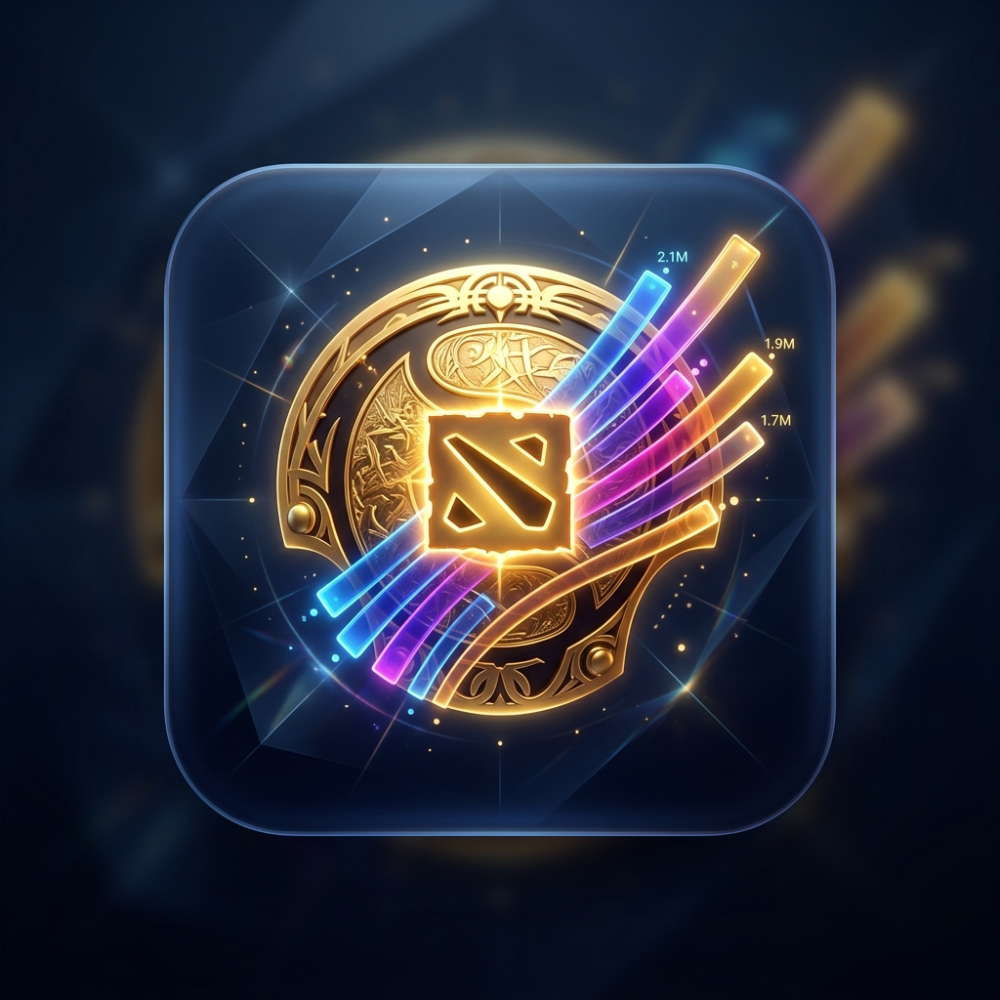

# Dota 2 History Visualizer ⚔️📊

A Python desktop application that transforms your Dota 2 match history into sleek, animated **"Bar Chart Race"** videos. Watch your most played heroes, win rates, KDA ratios, damage output, and role evolutions unfold from 2015 to the present day.



---

## 🚀 Features

- **⚡ Dynamic Period Pacing:** Automatically speeds up during quiet/inactive months (fast-forwarding in ~0.16s) and slows down during intense gaming sprees & rank swaps for cinematic focus.
- **🎨 Dedicated Desktop Window & App Icon:** Sleek CustomTkinter interface with screen-centered startup and custom app icon (`assets/icon.png`).
- **⚡ Blazing-Fast OpenCV Rendering Engine:** Custom native 2D canvas drawer rendering videos in seconds (**250+ FPS**).
- **🌈 32-Color Dynamic Palette:** Rotates across **32+ distinct, curated colors** so every hero bar stands out visually.
- **🚀 FFmpeg Hardware Acceleration:** Utilizes hardware GPU video encoders (`h264_videotoolbox` on macOS, `h264_nvenc` on Windows/Linux NVIDIA).
- **💾 SQLite Persistent Disk Caching:** Stores full match histories and profile avatars locally (`cache/dota_visualizer.db`) with incremental API sync. Loads data in **< 0.05 seconds**.
- **🖼️ Hero Icon Overlays & On-Bar Legends:** Hero PNG icons and names displayed directly on chart bars with shadow legibility.
- **📊 11 Unique Statistical Metrics:**
  - *Matches Played*, *Total Wins*, *Win Rate %*, *KDA Ratio (Efficiency)*, *Role Evolution (Core vs Support)*, *Laning Preference*, *Tower Damage (Thousands)*, *Total Damage (Millions)*, *Total Gold Farmed (Millions)*, *Total Deaths*, and *Most Purchased Items*.
- **🎯 3-Game Minimum Threshold:** Eliminates single-game 100% win rate or 20 KDA outliers for clean, meaningful rankings.
- **🎬 Direct Media Controls:** Built-in GUI buttons to **Open Output Folder**, **Play Latest Video**, and **Clear Output Videos**.
- **💻 Flexible Execution Modes:** Run via **Desktop GUI**, **Headless CLI**, or **Standalone Executable**.

---

## 🛠️ Requirements & Installation

### 1. Prerequisites
- **Python 3.10+**
- **FFmpeg** (Required for MP4 video encoding)
  - **macOS:** `brew install ffmpeg`
  - **Linux:** `sudo apt install ffmpeg`
  - **Windows:** Download from [gyan.dev](https://www.gyan.dev/ffmpeg/builds/) and add `ffmpeg/bin` to system PATH.

### 2. Install Dependencies
```bash
pip install -r requirements.txt
```

---

## ▶️ Execution Modes (How to Run & Test)

### Mode 1: Desktop GUI Application (Local UI)
```bash
python main.py
```
1. Enter your 32-bit Steam ID (e.g. `70388657` for Dendi).
2. Select metric and render quality preset.
3. Click **▶️ Generate Video**.
4. Use built-in buttons to **📂 Open Output Folder** or **▶️ Play Latest Video**.

---

### Mode 2: Headless Command Line Interface (CLI)
Run video generation directly from the terminal without launching the GUI:
```bash
python cli.py --player_id 70388657 --metric "Matches Played" --quality Normal
```
*Options:* `--player_id`, `--metric`, `--quality` (Draft, Normal, High, Ultra), `--output_dir`.

---

### Mode 3: Standalone Executable Build (PyInstaller)
Package the application into a standalone desktop application bundle:
```bash
python build.py
```
The compiled executable bundle will be located inside the `dist/` directory.

---

## 🧪 Running Unit Tests

Run the complete automated unit test suite:
```bash
python -m unittest discover tests
```