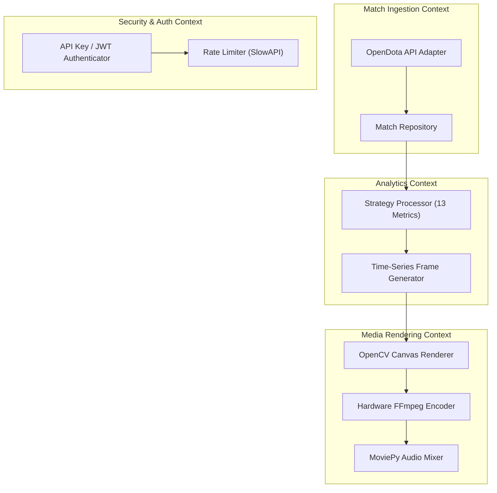
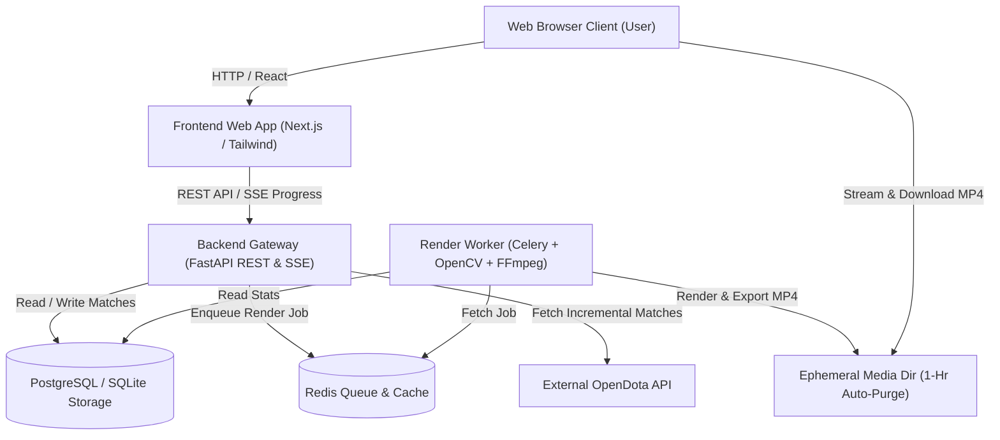

# Software Design Description (SDD) & Domain-Driven Design (DDD)
## Phase 4: Revamped Web Architecture, Decoupled Backend, & Ephemeral Media Storage

**Document Version:** 4.0.0  
**Status:** Approved Architecture Specification  
**Target Environment:** Distributed Cloud Web Architecture (Vercel FE + FastAPI BE + Redis Worker + Docker)

---

## 1. System Vision & Architecture Goals

Phase 4 transforms the Dota 2 History Visualizer from a monolithic desktop Python application into a **decoupled, web-native distributed platform**.

### Core Architectural Principles:
1. **Offline-First & Smart Ingestion:** Immediate cache loading (<0.01s) with background incremental API synchronization.
2. **Decoupled Backend & Frontend:** Fast, modern SPA/SSR frontend (React / Next.js) interacting with a high-performance Python FastAPI backend via REST and Server-Sent Events (SSE).
3. **Zero-Server-Bloat Ephemeral Media Storage:** Rendered MP4 videos are held in transient memory/storage for immediate browser streaming and client download, with automated **1-hour TTL auto-purge**. Server disk usage remains near 0 MB.
4. **Containerized Worker Queue:** Heavy OpenCV and FFmpeg video rendering offloaded to async worker queues (Celery + Redis) running in isolated Docker containers.
5. **Security & Free-Tier Cloud Compatibility:** API Key authentication, rate limiting, and CORS security designed for deployment on free cloud tiers (Render, Railway, Cloudflare, Vercel).

---

## 2. Domain-Driven Design (DDD) Specification



### 2.1 Bounded Contexts

#### A. Match Ingestion & Cache Context
- **Responsibility:** Interfacing with OpenDota API, managing local SQLite/PostgreSQL database storage, executing incremental match fetching, and persisting hero/item constants.
- **Aggregates:** `PlayerMatchHistory`
- **Entities:** `Match`, `PlayerProfile`, `HeroConstant`, `ItemConstant`

#### B. Analytics & Strategy Context
- **Responsibility:** Computing cumulative time-series dataframes across all 13 strategy metrics (`MatchesPlayed`, `HeroVersatility`, `TotalGold`, `KDA`, etc.), enforcing minimum game thresholds, and calculating dynamic start years.
- **Aggregates:** `CareerTimeSeries`
- **Value Objects:** `MetricDefinition`, `DatePeriod`, `HeroStatFrame`

#### C. Media Rendering & Production Context
- **Responsibility:** Native OpenCV frame rendering, smoothstep position interpolation, dynamic period pacing calculation, patch overlay rendering, FFmpeg piping, and background music blending.
- **Aggregates:** `RenderJob`
- **Value Objects:** `CanvasDimensions` (16:9 vs 9:16), `ThemePalette`, `RenderPreset`

#### D. Security, Auth, & Storage Context
- **Responsibility:** API Key validation, IP rate limiting, CORS management, generating ephemeral streaming tokens, and auto-purging expired media files.
- **Entities:** `ApiKey`, `EphemeralToken`, `MediaAsset`

---

### 2.2 Domain Events
- `MatchHistorySynced(player_id, new_matches_count)`
- `RenderJobEnqueued(job_id, player_id, metric, aspect_ratio, theme)`
- `RenderProgressUpdated(job_id, progress_percentage)`
- `VideoRenderCompleted(job_id, video_url, expires_at)`
- `MediaAssetPurged(job_id, file_path)`

---

## 3. System Architecture (C4 Model)

### 3.1 Container Diagram



---

## 4. Decoupled Backend & Frontend Architecture

### 4.1 Frontend Architecture (React / Next.js)
- **Framework:** Next.js (App Router) + TailwindCSS + Lucide Icons.
- **Features:**
  - Responsive Video Studio Interface (Desktop & Mobile web views).
  - Interactive **Live Canvas Preview** (renders 1-frame snapshots on metric/theme change).
  - Real-time **SSE Progress Bar** (Server-Sent Events streaming render status % live).
  - Built-in HTML5 Video Player with instant client-side MP4 download button.
  - Zero permanent server storage: video is streamed into browser memory (`Blob` URL) and downloaded to client device.

### 4.2 Backend Architecture (FastAPI + Async Workers)
- **Framework:** FastAPI (Python 3.11/3.12).
- **Task Queue:** Celery with Redis broker for background video rendering.
- **Rendering Engine:** Native OpenCV + FFmpeg hardware acceleration inside Linux Docker containers.

---

## 5. Ephemeral Media Storage & Client-Side Download Strategy

To allow hosting on free cloud servers (e.g. Render, Railway, Fly.io) without running out of disk space:

```
[Render Process] ──> Save MP4 to /tmp/renders/{job_id}.mp4 (TTL: 3600s)
                           │
                           ├──> Client streams online in HTML5 <video> tag
                           ├──> Client clicks "Download MP4" -> File saved to User's PC
                           │
                           └──> Background Cleanup Cron (Every 15 mins):
                                Deletes any file older than 60 minutes
```

1. **Transient Output Directory:** Rendered MP4 files are saved with a unique UUID (`job_id`).
2. **Ephemeral Stream Endpoint:** `/api/v1/videos/{job_id}` serves the MP4 file for browser streaming and direct download.
3. **Automated Purge Cron:** Background task purges any video file older than 1 hour. Disk usage stays under 50 MB regardless of traffic volume.

---

## 6. API Endpoint Specification

### `POST /api/v1/players/{player_id}/sync`
Triggers incremental match sync from OpenDota.
- **Request Headers:** `X-API-Key: <key>`
- **Response:**
```json
{
  "player_id": 70388657,
  "player_name": "Dendi",
  "total_matches": 21494,
  "new_matches_synced": 0,
  "last_synced_at": "2026-08-07T01:45:00Z"
}
```

### `POST /api/v1/render/jobs`
Enqueues a video render task.
- **Request Body:**
```json
{
  "player_id": "70388657",
  "metric": "Hero Versatility",
  "quality": "Normal",
  "aspect_ratio": "9:16",
  "theme": "Midnight Cyberpunk",
  "custom_audio_id": null
}
```
- **Response:**
```json
{
  "job_id": "9b1deb4d-3b7d-4b69-9141-c1e087f9859f",
  "status": "QUEUED",
  "estimated_duration_sec": 12
}
```

### `GET /api/v1/render/jobs/{job_id}/status` (SSE Supported)
Returns real-time render progress percentage.
- **Response:**
```json
{
  "job_id": "9b1deb4d-3b7d-4b69-9141-c1e087f9859f",
  "status": "PROCESSING",
  "progress_percent": 72,
  "video_url": null
}
```

### `GET /api/v1/videos/{job_id}`
Streams the rendered MP4 video or triggers browser file download (`Content-Disposition: attachment`).

---

## 7. Security & Free-Tier Hosting Specification

### 7.1 Security Architecture
1. **API Key Authentication:** Header validation (`X-API-Key`) for API access.
2. **Rate Limiting:** IP-based rate limiting via SlowAPI (e.g. Max 5 render jobs per 15 minutes per IP address).
3. **CORS Protection:** Configured origins for allowed web frontend domains.
4. **Input Sanitization:** Strict regex verification on 32-bit Steam IDs and metric parameter strings.

### 7.2 Docker Compose Architecture (`docker-compose.yml`)

```yaml
version: '3.8'

services:
  api:
    build:
      context: .
      dockerfile: docker/Dockerfile.api
    ports:
      - "8000:8000"
    environment:
      - REDIS_URL=redis://redis:6379/0
      - DATABASE_URL=sqlite:///./cache/dota_visualizer.db
      - API_SECRET_KEY=${API_SECRET_KEY}
    depends_on:
      - redis

  worker:
    build:
      context: .
      dockerfile: docker/Dockerfile.worker
    command: celery -A app.tasks worker --loglevel=info
    environment:
      - REDIS_URL=redis://redis:6379/0
      - DATABASE_URL=sqlite:///./cache/dota_visualizer.db
    volumes:
      - tmp_renders:/tmp/renders
    depends_on:
      - redis

  redis:
    image: redis:7-alpine
    ports:
      - "6379:6379"

volumes:
  tmp_renders:
```

---

## 8. Implementation Roadmap (Phase 4 Tasks)

| Task ID | Component | Description | Format |
|---|---|---|---|
| **P4-01** | Backend Infrastructure | FastAPI app setup with SQLite/PostgreSQL ORM & DB models | DDD Domain Layer |
| **P4-02** | Ingestion Engine | Offline-first smart sync with 24h TTL and OpenDota adapter | Ingestion Context |
| **P4-03** | Celery Worker Queue | Redis queue setup for async background video rendering | Rendering Context |
| **P4-04** | Security System | API key auth, CORS policy, and SlowAPI rate limiting | Security Context |
| **P4-05** | Ephemeral Purge | Automated background cron purging MP4 files > 1 hour old | Storage Context |
| **P4-06** | Frontend Web App | React / Next.js SPA with live preview, SSE progress bar & MP4 download | Web UI |
| **P4-07** | Docker Deployment | Dockerfile & docker-compose configurations for cloud hosting | DevOps |
