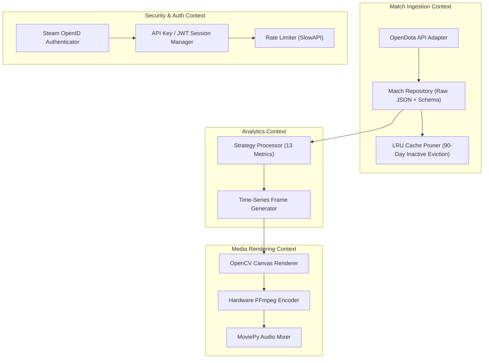
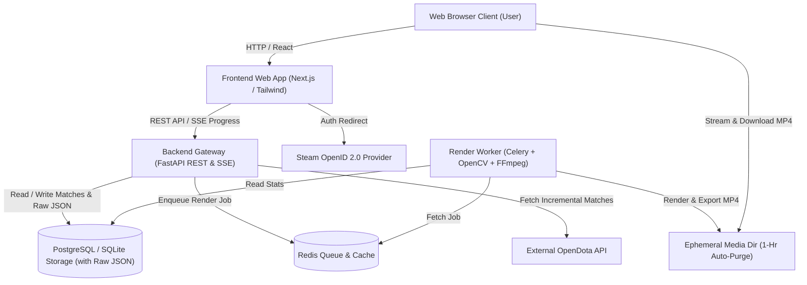

# Software Design Description (SDD) & Domain-Driven Design (DDD)
## Phase 4: Revamped Web Architecture, Decoupled Backend, & Ephemeral Media Storage

**Document Version:** 4.1.0  
**Status:** Approved Architecture Specification  
**Target Environment:** Distributed Cloud Web Architecture (Vercel FE + FastAPI BE + Redis Worker + Docker)

---

## 1. System Vision & Architecture Goals

Phase 4 transforms the Dota 2 History Visualizer from a monolithic desktop Python application into a **decoupled, web-native distributed platform**.

### Core Architectural Principles:
1. **Offline-First & Smart Ingestion:** Immediate cache loading (<0.01s) with background incremental API synchronization.
2. **Hybrid Authentication Model:**
   - **Public Lookup (Zero Friction):** Anyone can enter any 32-bit Steam ID (friends, pro players, content creators) to render public stats.
   - **Steam OpenID Authentication:** Optional Valve Steam login unlocking personal dashboards, custom music uploads, favorite theme preferences, and access to private Dota 2 profiles.
3. **Decoupled Backend & Frontend:** Fast, modern SPA/SSR frontend (React / Next.js) interacting with a high-performance Python FastAPI backend via REST and Server-Sent Events (SSE).
4. **Raw JSON Retention + LRU Cache Pruning Engine:**
   - Full `raw_json` payload retained in database tables to guarantee future extensibility for newly created visualization strategies.
   - Automatic **Least Recently Used (LRU) Database Pruning Task**: If database storage approaches tier limits (e.g. >80% capacity), automatically evicts raw match history for inactive public lookups (unaccessed for >90 days). If requested again, data re-populates dynamically.
5. **Zero-Server-Bloat Ephemeral Media Storage:** Rendered MP4 videos are held in transient storage for immediate browser streaming and client download, with automated **1-hour TTL auto-purge**. Server disk usage remains near 0 MB.
6. **Containerized Worker Queue:** Heavy OpenCV and FFmpeg video rendering offloaded to async worker queues (Celery + Redis) running in isolated Docker containers.
7. **Security & Free-Tier Cloud Compatibility:** API Key authentication, rate limiting, and CORS security designed for deployment on free cloud tiers (Render, Railway, Cloudflare, Vercel).

---

## 2. Domain-Driven Design (DDD) Specification



### 2.1 Bounded Contexts

#### A. Match Ingestion & Cache Context
- **Responsibility:** Interfacing with OpenDota API, storing `raw_json` payloads alongside structured schema fields in SQLite/PostgreSQL, executing background incremental match fetching, and running automated 90-day LRU cache pruning.
- **Aggregates:** `PlayerMatchHistory`
- **Entities:** `Match` (stores `raw_json`), `PlayerProfile`, `HeroConstant`, `ItemConstant`

#### B. Analytics & Strategy Context
- **Responsibility:** Computing cumulative time-series dataframes across all 13 strategy metrics (`MatchesPlayed`, `HeroVersatility`, `TotalGold`, `KDA`, etc.), enforcing minimum game thresholds, and calculating dynamic start years.
- **Aggregates:** `CareerTimeSeries`
- **Value Objects:** `MetricDefinition`, `DatePeriod`, `HeroStatFrame`

#### C. Media Rendering & Production Context
- **Responsibility:** Native OpenCV frame rendering, smoothstep position interpolation, dynamic period pacing calculation, patch overlay rendering, FFmpeg piping, and background music blending.
- **Aggregates:** `RenderJob`
- **Value Objects:** `CanvasDimensions` (16:9 vs 9:16), `ThemePalette`, `RenderPreset`

#### D. Security, Auth, & Storage Context
- **Responsibility:** Managing Valve Steam OpenID 2.0 authentication, issuing JWT session tokens, enforcing IP rate limits, validating API keys, and purging expired transient MP4 videos.
- **Entities:** `SteamUser`, `ApiKey`, `EphemeralToken`, `MediaAsset`

---

### 2.2 Domain Events
- `UserAuthenticatedViaSteam(steam_id64, display_name)`
- `MatchHistorySynced(player_id, new_matches_count)`
- `InactiveCachePruned(player_id, pruned_matches_count)`
- `RenderJobEnqueued(job_id, player_id, metric, aspect_ratio, theme)`
- `RenderProgressUpdated(job_id, progress_percentage)`
- `VideoRenderCompleted(job_id, video_url, expires_at)`
- `MediaAssetPurged(job_id, file_path)`

---

## 3. System Architecture (C4 Model)

### 3.1 Container Diagram



---

## 4. Decoupled Backend & Frontend Architecture

### 4.1 Hybrid Auth Architecture (Steam OpenID + Public Steam ID)
1. **Public Mode (Default)**: Enter any 32-bit Steam ID (`70388657`) for instant zero-friction video generation.
2. **Steam OpenID Mode**: Click "Sign in with Steam" to verify identity, access private match data, save custom music uploads, and store custom default themes.

### 4.2 Raw JSON Retention & LRU Pruning Specification
- **Raw JSON Preservation:** Every match row stores full `raw_json` text column to ensure 100% forward compatibility for future visualization strategies.
- **LRU Cache Pruner Cron:** A daily scheduled Celery task monitors database size. If storage exceeds 80% capacity, it evicts `raw_json` and match rows for public lookups whose `last_accessed_at` timestamp is older than 90 days.

---

## 5. Ephemeral Media Storage & Client-Side Download Strategy

To allow hosting on free cloud servers (e.g. Render, Railway, Fly.io) without running out of disk space:

```
[Render Process] ──> Save MP4 to /tmp/renders/{job_id}.mp4 (TTL: 3600s)
                           │
                           ├──> Client streams online in HTML5 <video> tag
                           ├──> Client clicks "Download MP4" -> File saved to User's PC
                           │
                           └──> Background Cleanup Cron (Every 15 mins):
                                Deletes any file older than 60 minutes
```

---

## 6. API Endpoint Specification

### `GET /auth/steam/login` & `GET /auth/steam/callback`
Handles Steam OpenID 2.0 authentication flow and returns a JWT session token.

### `POST /api/v1/players/{player_id}/sync`
Triggers incremental match sync from OpenDota.
- **Request Headers:** `X-API-Key: <key>`
- **Response:**
```json
{
  "player_id": 70388657,
  "player_name": "Dendi",
  "total_matches": 21494,
  "new_matches_synced": 0,
  "last_synced_at": "2026-08-07T01:45:00Z"
}
```

### `POST /api/v1/render/jobs`
Enqueues a video render task.
- **Request Body:**
```json
{
  "player_id": "70388657",
  "metric": "Hero Versatility",
  "quality": "Normal",
  "aspect_ratio": "9:16",
  "theme": "Midnight Cyberpunk",
  "custom_audio_id": null
}
```

---

## 7. Implementation Roadmap (Phase 4 Tasks)

| Task ID | Component | Description | Format |
|---|---|---|---|
| **P4-01** | Backend Infrastructure | FastAPI app setup with SQLite/PostgreSQL ORM & raw_json DB models | DDD Domain Layer |
| **P4-02** | Ingestion & LRU Pruning | Offline-first smart sync + 90-day LRU cache eviction task | Ingestion Context |
| **P4-03** | Steam OpenID Auth | Steam OpenID 2.0 login integration & JWT session manager | Auth Context |
| **P4-04** | Celery Worker Queue | Redis queue setup for async background video rendering | Rendering Context |
| **P4-05** | Security System | API key auth, CORS policy, and SlowAPI rate limiting | Security Context |
| **P4-06** | Ephemeral Purge | Automated background cron purging MP4 files > 1 hour old | Storage Context |
| **P4-07** | Frontend Web App | Next.js SPA with Steam login, public lookup, live preview & MP4 download | Web UI |
| **P4-08** | Docker Deployment | Dockerfile & docker-compose configurations for cloud hosting | DevOps |
